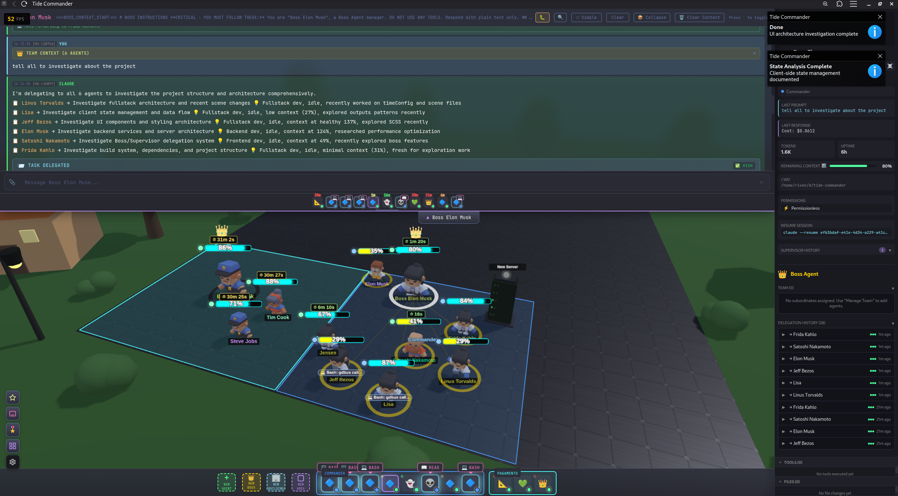

# 🌊 Tide Commander



A game-like Claude Code orchestrator. Deploy, position, and command multiple Claude Code instances on a strategic battlefield inspired by RTS games like Warcraft.

## 💡 Why Tide Commander?

Tired of working with tons of terminals with Claude Code open at the same time? Tide Commander transforms your AI-powered development workflow into a real-time strategy interface.

This project is not meant to be a game. It looks like a game but internally has many tools for developers, so using an IDE, at least for me, is almost unnecessary. The same interface has file diff viewers on the Claude Code conversation, and a file explorer with differences of uncommitted changes.

Think of it like having a team of AI developers at your command. Assign one agent to investigate a bug while another implements a feature. Watch them work in real-time, send follow-up commands, and keep your project moving forward on multiple fronts.

## 🎖️ Agent Concepts

Tide Commander introduces several powerful concepts for orchestrating your AI agents:

### Boss
The boss agent has context of other agents assigned to him. The boss can delegate tasks. Imagine you have a single boss to talk with, and the boss decides which of the subordinate agents is the most capable of doing the requested task. This saves a lot of time, without having to know which Claude Code terminal has which context. The boss can also give you a summary of the progress of their workers.

### Supervisor
Like god, the supervisor sees everything on the field, knows when an agent finished, and generates a summary of their last task, appending it to a global, centralized panel.

### Group Areas
Help to organize agents in projects and find them quickly. Areas can have assigned folders, enabling the file explorer on those added folders.

### Buildings (WIP)
The idea is to have a model on the field with customized functionality, like defining a server and being able to restart it from the battlefield.

### Classes
Like COD or Minecraft classes, you assign a class to the agent character. It has a linked model, a definition of instructions (like a claude.md), and a definition of skills (you can also create skills on the same interface).

### Commander View
A view where you can see all the Claude Code agent terminals on a single view, grouped by areas.

## ✨ Features

- 🎮 **3D Battlefield** - Visual command center with Three.js
- 🎯 **RTS Controls** - Click to select, right-click to move, number keys for quick selection
- 📡 **Real-time Activity Feed** - Watch your agents work in real-time
- 🤹 **Multi-Agent Management** - Spawn and control multiple Claude Code instances
- 💾 **Session Persistence** - Agents resume their Claude Code sessions across restarts
- 📊 **Context Tracking** - Mana bar visualization showing agent context usage
- 📁 **File Change Tracking** - See which files each agent has modified
- 📋 **Large Text & Screenshot Paste** - Compact and send large content easily
- ⌨️ **Custom Hotkeys** - Configurable keyboard shortcuts
- 🔐 **Permission Control** - Permissionless or permission-enabled per agent
- 🎬 **Custom Animations** - Customizable idle and working animations
- 🌐 **Multiplayer** - WebSocket-based multi-user support
- 📱 **Mobile Compatible** - Works on mobile devices

## 📋 Prerequisites

- Node.js 18+ or Bun
- Claude Code CLI (`claude` command available in PATH)

## 🚀 Getting Started

```bash
# Install dependencies
bun install

# Start the application
bun run dev
```

Open http://localhost:5173 in your browser (or your configured `VITE_PORT`) and you're ready to go! 🎉

## 🎮 How to Use

1. **Deploy an agent** - Click the **+ New Agent** button ➕
2. **Configure it** - Give it a name and choose a working directory 📁
3. **Select it** - Click on the agent in the 3D view or press 1-9 👆
4. **Send commands** - Type your task in the command bar and press Enter ⌨️
5. **Watch it work** - The activity feed shows real-time progress 👀
6. **Send follow-ups** - Agents maintain context, so you can have ongoing conversations 💬

You can spawn multiple agents, each working in different directories or on different tasks. Switch between them by clicking or using number keys.

## ⌨️ Keyboard Shortcuts

| Key | Action |
|-----|--------|
| 1-9 | Select agent by index |
| Escape | Deselect / Close modal |
| Alt+N | Spawn new agent |
| Enter | Send command (when input focused) |

## 🔧 How It Works

### Overview

Tide Commander provides a visual interface for managing multiple Claude Code CLI instances simultaneously. Each "agent" you spawn is a real Claude Code process running in the background, and you can send commands to them and watch their output in real-time.

### Core Components

**🖥️ Frontend (React + Three.js)**
- 3D battlefield where agents are visualized as characters
- WebSocket connection to receive real-time updates
- Command input for sending tasks to agents
- Activity feed showing what each agent is doing

**⚙️ Backend (Node.js + Express)**
- REST API for agent CRUD operations
- WebSocket server for real-time event streaming
- Process manager that spawns and controls Claude CLI instances

**🤖 Claude CLI Integration**
- Each agent runs `claude` with `--output-format stream-json`
- Events (tool usage, text output, errors) are parsed from stdout
- Commands are sent via stdin in stream-json format
- Sessions are persisted and can be resumed

### Architecture

```
┌─────────────────────────────────────────┐
│           Browser (Three.js)            │
│  - 3D battlefield visualization         │
│  - Agent selection & movement           │
│  - Command interface                    │
└─────────────────┬───────────────────────┘
                  │ WebSocket
┌─────────────────▼───────────────────────┐
│           Node.js Server                │
│  - Agent lifecycle management           │
│  - Claude CLI process management        │
│  - Event broadcasting                   │
└─────────────────┬───────────────────────┘
                  │ stdin/stdout (stream-json)
┌─────────────────▼───────────────────────┐
│         Claude Code Instances           │
│  - Each agent = Claude CLI process      │
│  - Events streamed via JSON output      │
└─────────────────────────────────────────┘
```

### Data Storage

**Server State** is saved to `~/.local/share/tide-commander/`:
- `agents.json` - Agent configurations (name, position, session mapping, token usage)
- `areas.json` - Drawing areas synced from the frontend
- `supervisor-history.json` - Agent supervisor history

**Claude Conversations** are read from `~/.claude/projects/`:
- Claude Code stores session files as JSONL (one JSON object per line)
- Directory names encode the working directory path (e.g., `/home/user/project` → `-home-user-project`)
- Tide Commander reads these to resume sessions and display conversation history

## 🔐 Permission Modes

Agents can operate in two permission modes:

### Bypass Mode (Default)
Agents run with `--dangerously-skip-permissions`, allowing them to execute any tool (Bash, Edit, Write, etc.) without asking for approval. This is ideal for trusted, autonomous work.

### Interactive Mode
Agents require user approval for potentially dangerous operations. This mode uses a hook-based system:

```
┌─────────────────────────────────────────┐
│         Claude Code Agent               │
│  Wants to run: Bash "rm -rf ./temp"     │
└─────────────────┬───────────────────────┘
                  │ PreToolUse hook
┌─────────────────▼───────────────────────┐
│       permission-hook.sh                │
│  1. Auto-approves safe tools (Read,     │
│     Glob, Grep, etc.)                   │
│  2. Checks remembered patterns          │
│  3. Sends dangerous ops to server       │
└─────────────────┬───────────────────────┘
                  │ HTTP POST /api/permission-request
┌─────────────────▼───────────────────────┐
│       Tide Commander Server             │
│  - Broadcasts to UI via WebSocket       │
│  - Holds request until user responds    │
└─────────────────┬───────────────────────┘
                  │ WebSocket
┌─────────────────▼───────────────────────┐
│       Browser UI                        │
│  - Shows permission dialog              │
│  - User approves/denies                 │
│  - Optional: Remember for this session  │
└─────────────────────────────────────────┘
```

#### Safe Tools (Auto-Approved)
These read-only tools are automatically approved without prompting:
- `Read`, `Glob`, `Grep` - File reading and searching
- `Task`, `TaskOutput` - Agent task management
- `WebFetch`, `WebSearch` - Web content fetching
- `TodoWrite` - Task list management
- `AskUserQuestion` - User interaction
- `EnterPlanMode`, `ExitPlanMode`, `Skill` - Planning tools

#### Dangerous Tools (Require Approval)
These tools prompt for user permission:
- `Bash` - Shell command execution
- `Edit`, `Write` - File modifications
- `NotebookEdit` - Jupyter notebook edits

#### Remembered Patterns
When approving a permission request, you can check "Remember this" to auto-approve similar future requests:
- **File operations**: Remembers the directory (e.g., approving `/project/src/file.ts` remembers `/project/src/`)
- **Bash commands**: Remembers the command prefix (e.g., approving `npm test` remembers `npm`)

Remembered patterns are stored in `~/.tide-commander/remembered-permissions.json` and can be cleared via the API or by deleting the file.

#### Setting Permission Mode
When spawning an agent, select the permission mode in the spawn dialog. You can also change it later by editing the agent configuration.

## ⚙️ Configuration

Ports can be configured via environment variables:

| Variable | Default | Description |
|----------|---------|-------------|
| `PORT` | 5174 | Backend server port |
| `VITE_PORT` | 5173 | Vite dev server port |
| `TIDE_SERVER` | `http://localhost:$PORT` | Server URL for hooks |

## 🛠️ Development

```bash
# Run client only
bun run dev:client

# Run server only
bun run dev:server

# Run both concurrently
bun run dev

# Build for production
bun run build
```

## 🐛 Troubleshooting

**Agent stuck in "working" status**
- The Claude process may have died unexpectedly
- Refresh the page - status sync runs on reconnect
- Check server logs for errors

**"Claude Code CLI not found"**
- Ensure `claude` is in your PATH
- Run `which claude` to verify installation

**WebSocket disconnects**
- Check that the server is running (default port 5174, or your configured `PORT`)
- Look for CORS or firewall issues

## 📄 License

MIT
